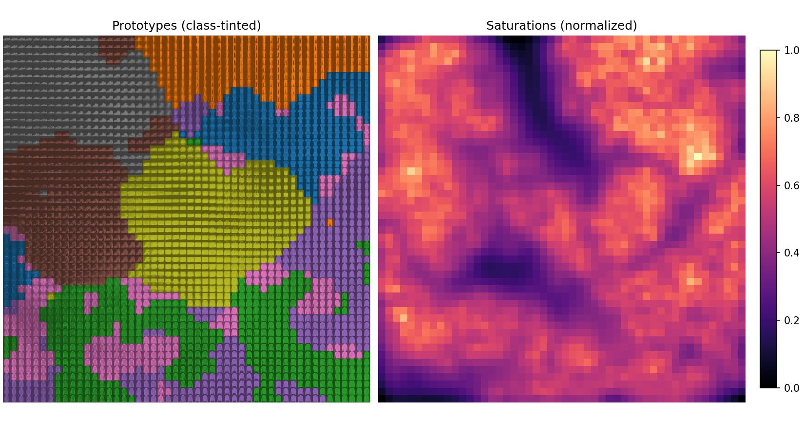

# SatSOM: Saturation Self-Organizing Map



## Overview

**SatSOM** is a PyTorch implementation of a Saturation Self-Organizing Map (SatSOM), a proof-of-concept architecture for continual learning. It provides:

* **Adaptive neighborhood** based on neuron saturation and Gaussian decay
* **Per-neuron learning rates and sigmas** that decay based on the amount of information they recieve
* **Label prototype updates** using softmax-based gradient steps
* **Quantile-based neuron disabling** for under-trained units

## Installation

1. Clone this repository:

   ```bash
   git clone git@github.com:Radinyn/satsom.git
   cd satsom
   ```
2. Install dependencies:

   ```bash
   pip install -r requirements.txt
   ```

## Usage Example

A more comprehensive example can be found in the eval module.

```python
import torch
from satsom import SatSOM, SatSOMParameters

# 1. Define parameters
params = SatSOMParameters(
    grid_shape=(10, 10),        # 10×10 grid of neurons
    input_dim=128,              # 128-dimensional input features
    output_dim=10,              # 10 classes (labels)
    initial_lr=0.1,             # initial learning rate
    initial_sigma=3.0,          # initial neighborhood radius
    Lr=0.01,                    # learning rate decay factor
    Lr_bias=0.1,                # neighborhood bias multiplier
    Lr_sigma=0.005              # sigma decay factor
)

# 2. Initialize model
device = torch.device('cuda' if torch.cuda.is_available() else 'cpu')
model = SatSOM(params).to(device)

# 3. Single training step
x = torch.randn(params.input_dim).to(device)
y = torch.nn.functional.one_hot(torch.tensor(3), num_classes=params.output_dim).float().to(device)
model.train()
model.step(x, y)

# 4. Inference
model.eval()
data = torch.randn(32, params.input_dim).to(device)
out = model(data)  # (batch_size, output_dim)
predictions = out.argmax(dim=1)
```

## API Reference

### `SatSOMParameters`

Dataclass containing all hyperparameters for initializing a SatSOM.

| Field           | Type             | Description                                                            |
| --------------- | ---------------- | ---------------------------------------------------------------------- |
| `grid_shape`    | `tuple[int,...]` | Dimensions of the neuron grid (e.g., `(m, n, ...)`).                   |
| `input_dim`     | `int`            | Dimensionality of input feature vectors.                               |
| `output_dim`    | `int`            | Dimensionality of output labels (e.g., number of classes).             |
| `initial_lr`    | `float`          | Initial learning rate for neuron weight updates.                       |
| `initial_sigma` | `float`          | Initial neighborhood radius (Gaussian sigma).                          |
| `Lr`            | `float`          | Decay rate for learning rate per update.                               |
| `Lr_bias`       | `float`          | Bias multiplier to scale neighborhood during training.                 |
| `Lr_sigma`      | `float`          | Decay rate for sigma per update.                                       |
| `q`             | `float`          | Quantile threshold below which neurons are disabled (default `0.005`). |
| `p`             | `float`          | Exponent for converting distance to proximity (default `10.0`).        |

## License

This project is licensed under the [MIT License](LICENSE).
